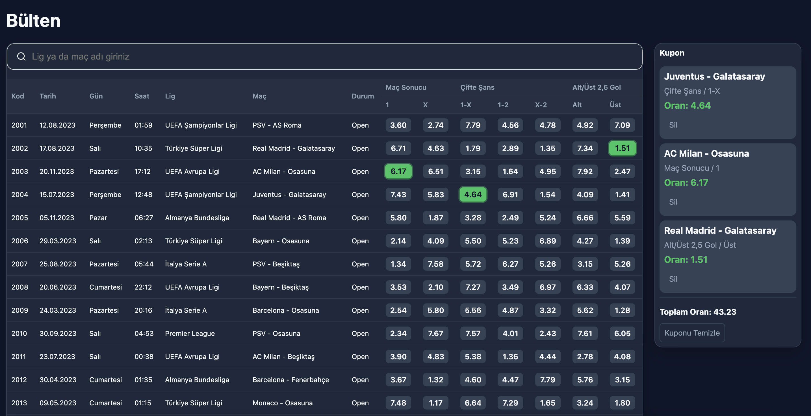

# Bets Board Case Study

## Özet

React ve Redux Toolkit kullanılarak geliştirilmiş responsive bir spor bahis bülteni uygulaması.

---

## Özellikler

- Axios ile API'den veri çekme
- Redux Toolkit ile state yönetimi
- Search/filter özelliği
- Infinite scroll yapısı
- Skeleton loading ekranı
- Desktop için board layout
- Mobile için card layout
- LocalStorage ile kupon verisinin tutulması
- Unit test desteği

---

## Mimari Yaklaşım

- Component bazlı mimari yapı
- useMemo ile performans optimizasyonu
- Redux Toolkit ile merkezi state yönetimi
- Async işlemler için createAsyncThunk kullanımı

---

## Kullanılan Teknolojiler

- React
- React Hooks
- Redux Toolkit
- Axios
- Webpack
- SCSS
- Babel
- Jest / React Testing Library

---

## Tasarım

UI tasarımı oluşturulurken Google Stitch (AI) referans alınmış, geliştirme süreci manuel olarak uygulanmıştır.

---

## Kurulum

npm install npm start

---

## Test

npm test

---
